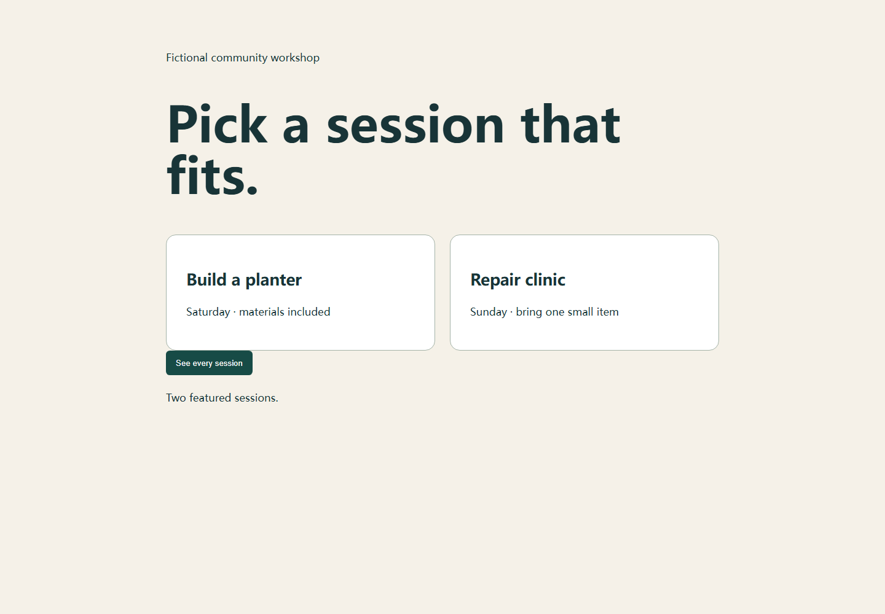
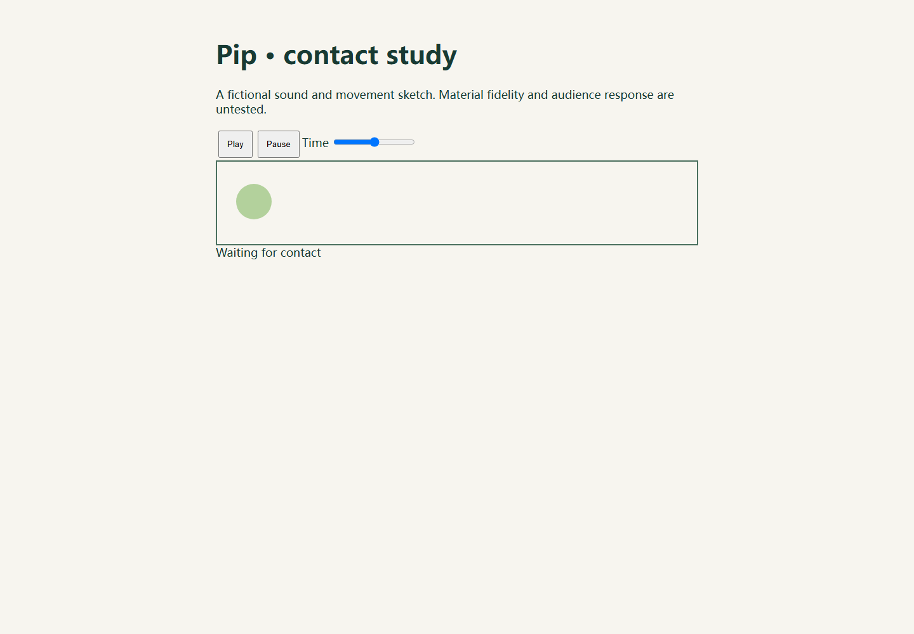

# Jervis · an architecture for learning from work

[](assets/jervis-research-atlas.png)

**Research question.** How can an AI system carry a useful judgment from one task to another while keeping its source, scope, revision and evaluation visible?

**System design.** A persistent Mission owns the work graph and contracts. Registry and EventLog retain versioned state and transitions. Short-lived workers receive scoped WorkOrders and return proposals. Designer is the first domain apprenticeship: source study and practice produce tentative design judgments that later briefs can select or reject. The original Designer corpus remains an independent advisory source.

**Reproducible result.** The public offline experiment exercises the original Mission, Registry, EventLog and Designer learning path with fixed synthetic model responses. It stores one experimental judgment, uses it in a new workshop brief, rejects it for an unrelated dispatch brief, commits both HTML artifacts and verifies their controls in Chromium. A separate composition experiment changes one shared material fact, rebuilds only dependent audio/page outputs and rejects a stale worker result.

**Evidence boundary.** These runs demonstrate state, scope and revision mechanics. They do not show an autonomous model discovering the judgment, a human preference gain, or a stable cross-domain capability. Historical Designer comparisons were mixed; they are distinct from the synthetic public replay.

[Study the architecture](docs/architecture.md) · [Inspect the Designer experiment](docs/case-designer.md) · [Inspect the composition experiment](docs/case-composition.md) · [Check claims against source](docs/evidence.md)

| Experiment | Observation | Open question |
| --- | --- | --- |
| Conditional transfer | The saved candidate is selected for one fresh brief and excluded from another. | Does selection improve human-rated work beyond a direct reference? |
| Composed execution | A field change rebuilds dependent outputs; an obsolete worker result becomes `STALE`. | Can this hold across less scripted workers and longer projects? |

The illustration explains the mechanism; the executable examples and linked evidence establish which parts were observed. [Editable technical sketch](assets/jervis-research-loop.svg).

## Run the complete public example

Python 3.12 or newer is required. Chromium runs headlessly; no account, API key, model download, market data or external source is needed.

```bash
python -m pip install ".[test]"
python -m playwright install chromium
python examples/run_designer_cycle.py
python examples/run_composition_cycle.py
python -m pytest
```

On Linux, install Chromium's system dependencies if Playwright asks for them (`python -m playwright install --with-deps chromium`). The example writes to `.demo/designer/` and refuses to overwrite an existing nonempty run. Use `--output PATH` for another run.

Open `.demo/designer/result.json` after execution. It links to the two practice pages, comparison, persisted task artifacts and browser observations. The example calls the original `Mission`, `DomainLearning`, `StateStore`, `Registry`, `EventLog`, `work_order`, `execute_tool` and `commit` paths. `examples/synthetic/responses.json` supplies fixed, visibly labeled model responses. **This run makes zero new model calls.**

The second command writes `.demo/composition/result.json`. It exercises a **separate** vNext composition on fictional material with fixed model responses. It also makes zero new model calls.

### What happens inside

```text
self-authored reference image + note
    → actual study node: practice + variant + browser capture
    → synthetic comparison response proposes one bounded judgment
    → Registry stores experimental version and source references
    → two fresh projects load that version
    → applicability selects it for one brief, rejects it for another
    → WorkOrder → HTML artifact → browser interaction → EventLog commit
```

The practice and variant use the same task and button behavior; only the action's grouping changes. The screenshots below are from the executable example, not borrowed reference imagery.

<p align="center"></p>

## Architecture decisions worth inspecting

| Question | Choice in the implementation | Evidence |
|---|---|---|
| What persists when a worker ends? | Project state and versioned objects live in `StateStore` / `Registry`; events capture attempted and committed transitions. | [`state.py`](src/ironman/mission/state.py), [`storage.py`](src/ironman/storage.py), generated SQLite file |
| How is a judgment kept tentative? | `DomainLearning.record_observed` retains the proposal, prior version, evidence and `experimental`/`no_update`/`rejected` decision. | [`domains.py`](src/ironman/mission/domains.py), [`test_apprenticeship.py`](tests/mission/test_apprenticeship.py) |
| How does a later task avoid blindly inheriting style? | `work_order` calls Designer applicability on the saved version; an empty selection is valid. | [`runtime.py`](src/ironman/mission/runtime.py), [`design_judgment.py`](src/ironman/mission/design_judgment.py), generated `result.json` |
| How do workers receive only relevant facts? | The scoped path compiles a permission-checked context packet and binds entity/input versions before dispatch. | [`scopes.py`](src/ironman/mission/scopes.py), [`test_scopes.py`](tests/mission/test_scopes.py) |

More detail: [architecture and tradeoffs](docs/architecture.md) · [Designer run and evidence](docs/case-designer.md) · [source and claim map](docs/evidence.md).

## A second, independent composition run

The fictional scene begins with a wood floor. The original `scene` tool produces timed contacts; the original `audio` tool renders a real WAV; `page` binds it into an HTML interaction; `compose_inspect` checks playback and seeking in Chromium. An owner-shaped synthetic intervention changes `floor.material` to gravel.

| After the fact changes | Actual runtime result |
| --- | --- |
| Sound + page + combined observation | Rebuilt at revision 2. The WAV bytes change. |
| Motion + independent production note | Their original result references and revisions remain. |
| A sound worker result returned after a handoff | Commit stored it as `STALE`; a successor result was accepted. |



[Hear the wood fixture](assets/composition-wood.wav) · [Hear the gravel fixture](assets/composition-gravel.wav) · [Inspect the case and its exact source entry points](docs/case-composition.md)

These are procedural sounds chosen by a fixed response fixture. Their acoustic realism, design quality and human effect were not evaluated. The material change, dependency impact, versioned result references, WAV render, browser checks and stale-result rejection run through the original Mission and Toolkit code.

## Repository map

```text
src/ironman/storage.py        Registry and EventLog
src/ironman/learning/         evidence, candidate memory, source intake, workers
src/ironman/mission/          project state, work orders, scope, Designer, execution
schemas/ + control/          original object schema and lifecycle policy
examples/synthetic/          self-authored pages and fixed model responses
examples/run_designer_cycle.py  domain-learning replay
examples/run_composition_cycle.py  independent vNext composition replay
tests/                      original focused tests plus clean-output integration
docs/                       architecture choices, case narrative and evidence limits
```

The public slice includes the real source modules needed by the run and the surrounding architecture. The only release portability edits change the local Sales triage import to an in-package source file and use Playwright's bundled Chromium instead of a machine-specific Edge channel. No private Registry, original Designer media, model credentials or local user data is included.

## Evidence boundary

- The public run proves that the **mechanism executes** with synthetic model responses: it persists a candidate, reopens it in new projects, selects or rejects it, writes artifacts and checks browser behavior.
- The fixed responses do not prove that a live model would make the same design judgment. Functional browser checks do not prove better design, user preference, comprehension or general capability gain.
- The public composition replay independently verifies a field-specific invalidation, preservation of unrelated work, actual WAV and browser artifacts, and a rejected late worker result. It does not claim the Designer learning happened in the same execution.

No open-source license has been selected for this public source release.
