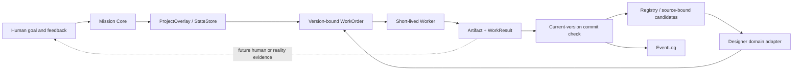

# Architecture and tradeoffs

Jervis separates persistent project state from temporary worker execution. The Core decides which bounded work to issue and what result may commit. Domain adapters own their representations and observations. A worker response is a proposal, never a new permission or a persistent identity by itself.

## Design decisions

### Keep learning separate from authority

**Problem.** A design exercise can create a useful hypothesis while leaving human effect unknown. If every model judgment becomes a global rule, later tasks inherit an untested style.

**Choice.** `DomainLearning` records the proposal and its assessment under a versioned, experimental identity. A later `work_order` runs applicability again. The model may return no selected IDs. The original advisory Designer remains separate.

**Cost.** The new task spends one applicability decision and can reject a potentially useful candidate. The public fixture demonstrates the mechanism; it does not measure whether that judgment improves design. Promote only with separate external evidence.

### Persist identity, replace execution

**Problem.** Model workers are transient, while a project must retain its brief, sources, current facts, versioned outputs and unresolved questions.

**Choice.** `StateStore` saves a `ProjectOverlay` over the existing Registry. `Mission.work_order` binds current input versions and artifacts. `Mission.commit` rejects a stale result before it can overwrite newer state; the result is still retained for audit. EventLog records dispatch, applied results and rejection.

**Cost.** Bounded state and version bindings make each operation more explicit. This is local project recovery and auditability, not a claim of exactly-once external side effects.

### Compile scope before worker input

**Problem.** Separate audio, motion, visual and research branches need shared facts without receiving each other's full private histories.

**Choice.** The vNext path in `scopes.py` checks permissions before loading local memory, selects declared entity fields and exposes dependency interfaces. Its tests cover denied reads and field-specific impact.

**Cost.** A missing interface or contract field stops or narrows work. The public Designer example uses the original non-vNext study path; composition and worker replacement are a separate replay target.

## What would change these choices

- Repeated blind human evaluation showing the candidate worsens relevant tasks would narrow or reject it; functional checks alone cannot promote it.
- A real multi-process failure showing an old Worker can still overwrite a successor would require stronger commit eligibility before claiming reliable replacement.
- Evidence that scope filtering admits forbidden bodies to a worker would require repair before using that path for sensitive domains.
